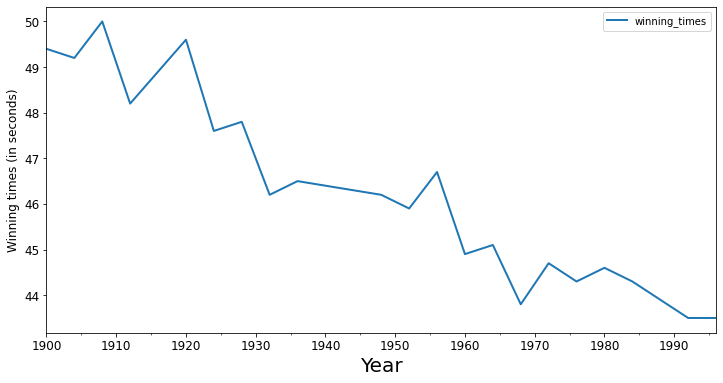
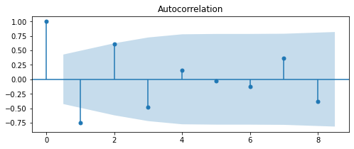
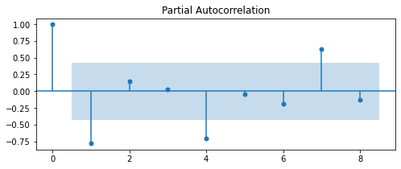

# ARMA Models in `statsmodels` - Lab 

## Introduction

In this lesson, you'll fit an ARMA model using `statsmodels` to a real-world dataset. 


## Objectives

In this lab you will: 

- Decide the optimal parameters for an ARMA model by plotting ACF and PACF and interpreting them 
- Fit an ARMA model using statsmodels 

## Dataset

Run the cell below to import the dataset containing the historical running times for the men's 400m in the Olympic games.


```python
import pandas as pd
import matplotlib.pyplot as plt
import numpy as np

data = pd.read_csv('winning_400m.csv')
data['year'] = pd.to_datetime(data['year'].astype(str))
data.set_index('year', inplace=True)
```


```python
# __SOLUTION__ 
import pandas as pd
import matplotlib.pyplot as plt
import numpy as np

data = pd.read_csv('winning_400m.csv')
data['year'] = pd.to_datetime(data['year'].astype(str))
data.set_index('year', inplace=True)
```


```python
# Preview the dataset
data
```


```python
# __SOLUTION__ 
# Preview the dataset
data
```


<div>
<style scoped>
    .dataframe tbody tr th:only-of-type {
        vertical-align: middle;
    }

    .dataframe tbody tr th {
        vertical-align: top;
    }

    .dataframe thead th {
        text-align: right;
    }
</style>
<table border="1" class="dataframe">
  <thead>
    <tr style="text-align: right;">
      <th></th>
      <th>winning_times</th>
    </tr>
    <tr>
      <th>year</th>
      <th></th>
    </tr>
  </thead>
  <tbody>
    <tr>
      <th>1900-01-01</th>
      <td>49.4</td>
    </tr>
    <tr>
      <th>1904-01-01</th>
      <td>49.2</td>
    </tr>
    <tr>
      <th>1908-01-01</th>
      <td>50.0</td>
    </tr>
    <tr>
      <th>1912-01-01</th>
      <td>48.2</td>
    </tr>
    <tr>
      <th>1920-01-01</th>
      <td>49.6</td>
    </tr>
    <tr>
      <th>1924-01-01</th>
      <td>47.6</td>
    </tr>
    <tr>
      <th>1928-01-01</th>
      <td>47.8</td>
    </tr>
    <tr>
      <th>1932-01-01</th>
      <td>46.2</td>
    </tr>
    <tr>
      <th>1936-01-01</th>
      <td>46.5</td>
    </tr>
    <tr>
      <th>1948-01-01</th>
      <td>46.2</td>
    </tr>
    <tr>
      <th>1952-01-01</th>
      <td>45.9</td>
    </tr>
    <tr>
      <th>1956-01-01</th>
      <td>46.7</td>
    </tr>
    <tr>
      <th>1960-01-01</th>
      <td>44.9</td>
    </tr>
    <tr>
      <th>1964-01-01</th>
      <td>45.1</td>
    </tr>
    <tr>
      <th>1968-01-01</th>
      <td>43.8</td>
    </tr>
    <tr>
      <th>1972-01-01</th>
      <td>44.7</td>
    </tr>
    <tr>
      <th>1976-01-01</th>
      <td>44.3</td>
    </tr>
    <tr>
      <th>1980-01-01</th>
      <td>44.6</td>
    </tr>
    <tr>
      <th>1984-01-01</th>
      <td>44.3</td>
    </tr>
    <tr>
      <th>1988-01-01</th>
      <td>43.9</td>
    </tr>
    <tr>
      <th>1992-01-01</th>
      <td>43.5</td>
    </tr>
    <tr>
      <th>1996-01-01</th>
      <td>43.5</td>
    </tr>
  </tbody>
</table>
</div>


Plot this time series data. 


```python
# Plot the time series
```


```python
# __SOLUTION__ 
# Plot the time series
data.plot(figsize=(12,6), linewidth=2, fontsize=12)
plt.xlabel('Year', fontsize=20)
plt.ylabel('Winning times (in seconds)', fontsize=12);
```





If you plotted the time series correctly, you should notice that it is not stationary. So, difference the data to get a stationary time series. Make sure to remove the missing values.


```python
# Difference the time series
data_diff = None
data_diff
```


```python
# __SOLUTION__ 
# Difference the time series
data_diff = data.diff().dropna()
data_diff
```


<div>
<style scoped>
    .dataframe tbody tr th:only-of-type {
        vertical-align: middle;
    }

    .dataframe tbody tr th {
        vertical-align: top;
    }

    .dataframe thead th {
        text-align: right;
    }
</style>
<table border="1" class="dataframe">
  <thead>
    <tr style="text-align: right;">
      <th></th>
      <th>winning_times</th>
    </tr>
    <tr>
      <th>year</th>
      <th></th>
    </tr>
  </thead>
  <tbody>
    <tr>
      <th>1904-01-01</th>
      <td>-0.2</td>
    </tr>
    <tr>
      <th>1908-01-01</th>
      <td>0.8</td>
    </tr>
    <tr>
      <th>1912-01-01</th>
      <td>-1.8</td>
    </tr>
    <tr>
      <th>1920-01-01</th>
      <td>1.4</td>
    </tr>
    <tr>
      <th>1924-01-01</th>
      <td>-2.0</td>
    </tr>
    <tr>
      <th>1928-01-01</th>
      <td>0.2</td>
    </tr>
    <tr>
      <th>1932-01-01</th>
      <td>-1.6</td>
    </tr>
    <tr>
      <th>1936-01-01</th>
      <td>0.3</td>
    </tr>
    <tr>
      <th>1948-01-01</th>
      <td>-0.3</td>
    </tr>
    <tr>
      <th>1952-01-01</th>
      <td>-0.3</td>
    </tr>
    <tr>
      <th>1956-01-01</th>
      <td>0.8</td>
    </tr>
    <tr>
      <th>1960-01-01</th>
      <td>-1.8</td>
    </tr>
    <tr>
      <th>1964-01-01</th>
      <td>0.2</td>
    </tr>
    <tr>
      <th>1968-01-01</th>
      <td>-1.3</td>
    </tr>
    <tr>
      <th>1972-01-01</th>
      <td>0.9</td>
    </tr>
    <tr>
      <th>1976-01-01</th>
      <td>-0.4</td>
    </tr>
    <tr>
      <th>1980-01-01</th>
      <td>0.3</td>
    </tr>
    <tr>
      <th>1984-01-01</th>
      <td>-0.3</td>
    </tr>
    <tr>
      <th>1988-01-01</th>
      <td>-0.4</td>
    </tr>
    <tr>
      <th>1992-01-01</th>
      <td>-0.4</td>
    </tr>
    <tr>
      <th>1996-01-01</th>
      <td>0.0</td>
    </tr>
  </tbody>
</table>
</div>


Use `statsmodels` to plot the ACF and PACF of this differenced time series. 


```python
# Plot the ACF

```


```python
# __SOLUTION__ 
# Plot the ACF
from statsmodels.graphics.tsaplots import plot_acf
fig, ax = plt.subplots(figsize=(8,3))
plot_acf(data_diff,ax=ax, lags=8);
```





```python
# Plot the PACF

```


```python
# __SOLUTION__ 
# Plot the PACF
from statsmodels.graphics.tsaplots import plot_pacf
fig, ax = plt.subplots(figsize=(8,3))
plot_pacf(data_diff,ax=ax, lags=8);
```





Based on the ACF and PACF, fit an ARMA model with the right orders for AR and MA. Feel free to try different models and compare AIC and BIC values, as well as significance values for the parameter estimates. 


```python

```


```python
# __SOLUTION__ 
# Import ARMA
from statsmodels.tsa.arima_model import ARMA

# Fit an ARMA(1,0) model
mod_arma = ARMA(data_diff, order=(1,0))
res_arma = mod_arma.fit()

# Print out summary information on the fit
print(res_arma.summary())
```

                                  ARMA Model Results                              
    ==============================================================================
    Dep. Variable:          winning_times   No. Observations:                   21
    Model:                     ARMA(1, 0)   Log Likelihood                 -20.054
    Method:                       css-mle   S.D. of innovations              0.618
    Date:                Mon, 13 Jan 2020   AIC                             46.107
    Time:                        15:00:37   BIC                             49.241
    Sample:                             0   HQIC                            46.787
                                                                                  
    =======================================================================================
                              coef    std err          z      P>|z|      [0.025      0.975]
    ---------------------------------------------------------------------------------------
    const                  -0.2885      0.080     -3.602      0.002      -0.445      -0.131
    ar.L1.winning_times    -0.7186      0.137     -5.262      0.000      -0.986      -0.451
                                        Roots                                    
    =============================================================================
                      Real          Imaginary           Modulus         Frequency
    -----------------------------------------------------------------------------
    AR.1           -1.3916           +0.0000j            1.3916            0.5000
    -----------------------------------------------------------------------------


    //anaconda3/lib/python3.7/site-packages/statsmodels/tsa/base/tsa_model.py:219: ValueWarning: A date index has been provided, but it has no associated frequency information and so will be ignored when e.g. forecasting.
      ' ignored when e.g. forecasting.', ValueWarning)


```python

```


```python
# __SOLUTION__ 
# Fit an ARMA(2,1) model
mod_arma = ARMA(data_diff, order=(2,1))
res_arma = mod_arma.fit()

# Print out summary information on the fit
print(res_arma.summary())
```

                                  ARMA Model Results                              
    ==============================================================================
    Dep. Variable:          winning_times   No. Observations:                   21
    Model:                     ARMA(2, 1)   Log Likelihood                 -18.955
    Method:                       css-mle   S.D. of innovations              0.562
    Date:                Mon, 13 Jan 2020   AIC                             47.911
    Time:                        15:00:45   BIC                             53.133
    Sample:                             0   HQIC                            49.044
                                                                                  
    =======================================================================================
                              coef    std err          z      P>|z|      [0.025      0.975]
    ---------------------------------------------------------------------------------------
    const                  -0.2916      0.073     -4.018      0.001      -0.434      -0.149
    ar.L1.winning_times    -1.6827      0.119    -14.199      0.000      -1.915      -1.450
    ar.L2.winning_times    -0.7714      0.128     -6.022      0.000      -1.022      -0.520
    ma.L1.winning_times     0.9999      0.132      7.550      0.000       0.740       1.259
                                        Roots                                    
    =============================================================================
                      Real          Imaginary           Modulus         Frequency
    -----------------------------------------------------------------------------
    AR.1           -1.0907           -0.3268j            1.1386           -0.4537
    AR.2           -1.0907           +0.3268j            1.1386            0.4537
    MA.1           -1.0001           +0.0000j            1.0001            0.5000
    -----------------------------------------------------------------------------


    //anaconda3/lib/python3.7/site-packages/statsmodels/tsa/base/tsa_model.py:219: ValueWarning: A date index has been provided, but it has no associated frequency information and so will be ignored when e.g. forecasting.
      ' ignored when e.g. forecasting.', ValueWarning)


```python

```


```python
# __SOLUTION__ 
# Fit an ARMA(2,2) model
mod_arma = ARMA(data_diff, order=(2,2))
res_arma = mod_arma.fit()

# Print out summary information on the fit
print(res_arma.summary())
```

                                  ARMA Model Results                              
    ==============================================================================
    Dep. Variable:          winning_times   No. Observations:                   21
    Model:                     ARMA(2, 2)   Log Likelihood                 -16.472
    Method:                       css-mle   S.D. of innovations              0.461
    Date:                Mon, 13 Jan 2020   AIC                             44.943
    Time:                        15:00:53   BIC                             51.210
    Sample:                             0   HQIC                            46.303
                                                                                  
    =======================================================================================
                              coef    std err          z      P>|z|      [0.025      0.975]
    ---------------------------------------------------------------------------------------
    const                  -0.2718      0.098     -2.779      0.013      -0.463      -0.080
    ar.L1.winning_times    -1.7575      0.097    -18.070      0.000      -1.948      -1.567
    ar.L2.winning_times    -0.9182      0.092    -10.002      0.000      -1.098      -0.738
    ma.L1.winning_times     1.5682      0.221      7.083      0.000       1.134       2.002
    ma.L2.winning_times     1.0000      0.253      3.951      0.001       0.504       1.496
                                        Roots                                    
    =============================================================================
                      Real          Imaginary           Modulus         Frequency
    -----------------------------------------------------------------------------
    AR.1           -0.9571           -0.4161j            1.0436           -0.4347
    AR.2           -0.9571           +0.4161j            1.0436            0.4347
    MA.1           -0.7841           -0.6206j            1.0000           -0.3934
    MA.2           -0.7841           +0.6206j            1.0000            0.3934
    -----------------------------------------------------------------------------


    //anaconda3/lib/python3.7/site-packages/statsmodels/tsa/base/tsa_model.py:219: ValueWarning: A date index has been provided, but it has no associated frequency information and so will be ignored when e.g. forecasting.
      ' ignored when e.g. forecasting.', ValueWarning)


## What is your final model? Why did you pick this model?


```python
# Your comments here
```


```python
# __SOLUTION__ 

"""
ARMA(1,0), ARMA(2,2) and ARMA(2,1) all seem to have decent fits with significant parameters. 
Depending on whether you pick AIC or BIC as a model selection criterion, 
your result may vary. In this situation, you'd generally go for a model with fewer parameters, 
so ARMA(1,0) seems fine. Note that we have a relatively short time series, 
which can lead to a more difficult model selection process.
"""
```


    "\nARMA(1,0), ARMA(2,2) and ARMA(2,1) all seem to have decent fits with significant parameters. \nDepending on whether you pick AIC or BIC as a model selection criterion, \nyour result may vary. In this situation, you'd generally go for a model with fewer parameters, \nso ARMA(1,0) seems fine. Note that we have a relatively short time series, \nwhich can lead to a more difficult model selection process.\n"


## Summary 

Well done. In addition to manipulating and visualizing time series data, you now know how to create a stationary time series and fit ARMA models. 
